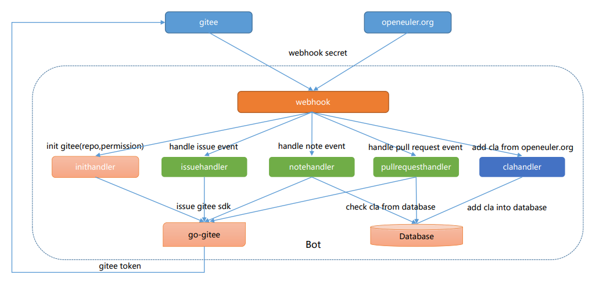

# ci-bot

## Introduction

This repository is used to address the code of openEuler ci bot.

## Architecture



## Prerequisites

You'll need to setup a MySQL Database before you are getting started.
This is an example to create Database instance.

* Setup MySQL instance by the Huawei Cloud Relational Database Service (RDS)
* Login in MySQL with your account and password
* Create database instance by running the following command
    ```
    CREATE DATABASE cibot;
    ```
The information of database instance will be used in the following Installation.

## Getting Started

* [Getting Started on Locally](deploy/locally/README.md)
* [Getting Started on CCE](deploy/cce/README.md)

## Command Help

See the [Command Help](https://gitee.com/openeuler/community/blob/master/en/sig-infrastructure/command.md) file for details.
> For Chinese version, please refer to [命令帮助](https://gitee.com/openeuler/community/blob/master/zh/sig-infrastructure/command.md).

## License

See the [LICENSE](LICENSE) file for details.
